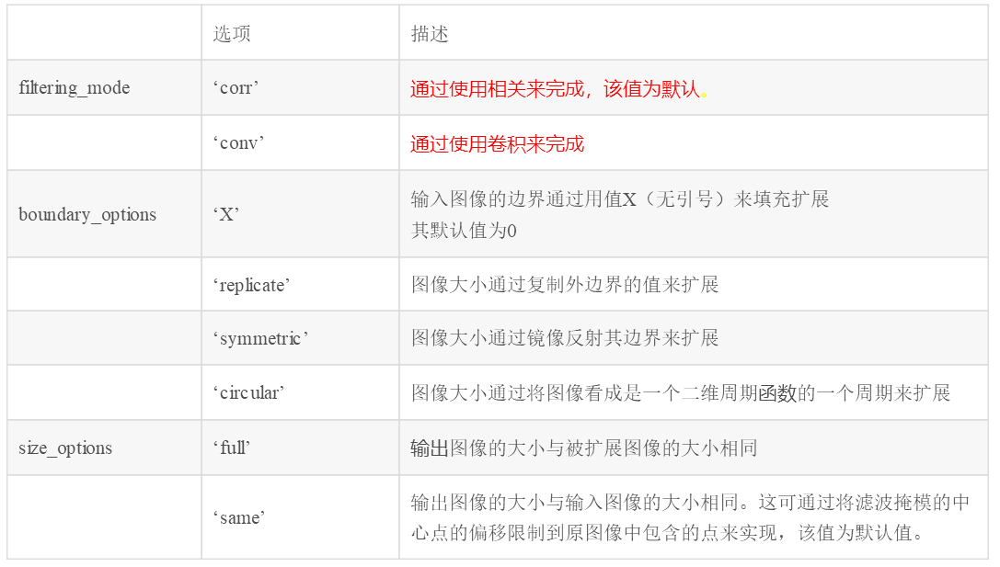
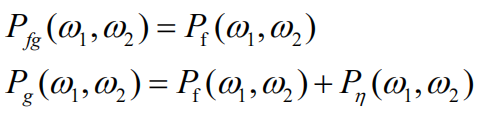

数字图像处理第六次作业

班级：自动化64，姓名：何佳，学号：2160700002，提交日期：2019.4.2

摘要：本次作业综合运用了之前所学的各类滤波器，对加噪后的图像进行图像恢复，并分析各滤波恢复算法的性能优劣。加入的噪声包括了高斯噪声和椒盐噪声，所使用的滤波器包括了算术均值滤波器、几何均值滤波器、谐波均值滤波器、逆谐波均值滤波器（Q>0）、逆谐波均值滤波器（Q<0）、逆谐波均值滤波器（Q=0）、中值滤波器，还有维纳滤波器、最小二乘方滤波器。另外，也掌握了图像运动模糊的原理及方法。

一、在测试图像上产生高斯噪声lena图-需能指定均值和方差；并用多种滤波器恢复图像，分析各自优缺点；

1.问题分析

1.1图像退化/复原的模型

如下图所示，在本章中，退化过程被建模为一个退化函数和一个加性噪声项，对一幅输入图像f(x,y)进行处理，产生一幅退化后的图像g(x,
y)。给定g(x, y)和关于退化函数H的一些知识以及关于加性噪声项η (x,y)的一些知识后，图像复原的目的就是获得原始图像的一个估计f(x,y)。通常，我们希望这一估计尽可能地接近原始输人图像，并且H和η的信息知道得越多，所得到的结果越接近f(x,y)。在本章中使用的大部分复原方法都是以不同类型的图像复原滤波器为基础的。

如果H是个线性的、位置不变的过程，那么空间城中的退化图像可由下式给出：

其中，h(x, y)是退化函数的空间表示，符号“★”表示空间卷积。上式等价的频率域表示为：

1.2 高斯噪声

高斯随机变量z的PDF由下式给出：

其中，z表示灰度值，表示z的均值，σ表示z的标准差。

1.3 算术均值滤波器

算术均值滤波器由如下表达式给出：

其中，Sxy表示中心在点(x,y)处、大小为m\*n的矩形子图像窗口（邻域）的一组坐标，并在点(x,y)处用f(x,y)复原(x,y)处的像素。

均值滤波平滑一幅图像中的局部变化，虽然模糊了结果，但降低了噪声。

1.4 几何均值滤波器

几何均值滤波器由如下表达式给出：

几何均值滤波器实现的平滑可与算术均值滤波器相比，但这种处理中丢失的图像细节更少。

1.5 谐波均值滤波器

谐波均值滤波器由如下表达式给出：

谐波均值滤波器对盐粒噪声效果较好，但不适于胡椒噪声。它善于处理像高斯噪声那样的其他噪声。

1.6 逆谐波均值滤波器

逆谐波均值滤波器通过如下表达式得到复原图像：

其中Q为滤波器阶数。这种滤波器减少或在实际中消除椒盐噪声的影响。当Q值为正时，该滤波器消除胡椒噪声；当Q值为负时，该滤波器消除盐粒噪声。但它不能同时消除这两种噪声。当Q=0时，该滤波器简化为算术均值滤波器；而当Q=-1时，为谐波均值滤波器。

1.7中值滤波器

中值滤波器属于统计排序滤波器，其原理是空间滤波器的响应基于由该滤波器包围的图像区域中的像素值排序。排序结果决定滤波器响应。

中值滤波器使用一个像素邻域中的灰度级的中值来替代该像素的值，即：

中值滤波器的应用非常普遍，其特点在于消除脉冲而不平滑图像，对于某些噪声可提供良好的去噪能力，且比相同尺寸的线性平滑滤波器引起的模糊更少。

2.编程实现

2.1 添加高斯噪声

采用以下matlab中imnoise函数，将均值为M、方差为V的高斯噪声添加到图像I上：

J = IMNOISE(I,'gaussian',M,V)

当M和V缺省时，默认M=0，V=0.01

2.2 滤波恢复

下面介绍滤波恢复用到的matlab函数：

（1）fspecial函数

fspecial函数用于创建预定义的滤波算子，其语法格式为：

h = fspecial(type)

h = fspecial(type,parameters,sigma)

参数type制定算子类型，parameters指定相应的参数，具体格式为：

type='average'，为均值滤波，参数为n，代表模版尺寸，用向量表示，默认值为[3,3]。

type= 'gaussian'，为高斯低通滤波器，参数有两个，n表示模版尺寸，默认值为[3,3]，sigma表示滤波器的标准差，单位为像素，默认值为 0.5。

type= 'laplacian'，为拉普拉斯算子，参数为alpha，用于控制拉普拉斯算子的形状，取值范围为[0,1]，默认值为0.2。

type= 'log'，为拉普拉斯高斯算子，参数有两个，n表示模版尺寸，默认值为[3,3]，sigma为滤波器的标准差，单位为像素，默认值为0.5

type= 'prewitt'，为prewitt算子，用于边缘增强，无参数。

type= 'sobel'，为著名的sobel算子，用于边缘提取，无参数。

type= 'unsharp'，为对比度增强滤波器，参数alpha用于控制滤波器的形状，范围为[0,1]，默认值为0.2。

（2）imfilter函数

imfilter函数用于对任意类型数组或多维图像进行滤波，其语法格式为：

B = imfilter(A,H)

B = imfilter(A,H,option1,option2,...)

或写作g = imfilter(f, w, filtering_mode, boundary_options, size_options)

其中，f为输入图像，w为滤波掩模，g为滤波后图像。filtering_mode用于指定在滤波过程中是使用“相关”还是“卷积”。boundary_options用于处理边界充零问题，边界的大小由滤波器的大小确定。具体参数选项见下表：

（3）medfilt2函数

medfilt2函数用于执行二维中值滤波，使用方法如下：

B = medfilt2(A, [m n])

B = medfilt2(A)

其中B是中值滤波后的图象矩阵，A是原图矩阵，m和n是处理模版大小，默认3×3。

3.处理结果

3.1 在lena.bmp上添加不同均值方差的高斯噪声：

lena.bmp原图为:

（1）均值mean=0.02，方差variance=0.01

（2）均值mean=0.5，方差variance=0.01

（3）均值mean=0.5，方差variance=0.01

3.2 采用多种滤波器恢复图像

以加入均值为0.02，方差为0.01高斯噪声的lena.bmp为例，采用5\*5的下列滤波器进行滤波：算术均值滤波器、几何均值滤波器、谐波均值滤波器、逆谐波均值滤波器（Q=1.5）、逆谐波均值滤波器（Q=-1.5）、中值滤波器。

4.结果分析与讨论

4.1 加入均值方差不同的高斯噪声对图像的影响

当高斯噪声的均值不变时，方差越大，图像噪声越严重；当高斯噪声的方差不变时，均值越大，使得整个图像灰度值变亮。

4.2 不同滤波器性能比较

从上面的结果来看，算术均值滤波和中值滤波的效果良好。算术均值滤波器在降低噪声的同时也模糊了图像，而中值滤波器可消除脉冲而不平滑图像，且比相同尺寸的线性平滑滤波器引起的模糊更少。

但从上面的结果看，几何滤波器、谐波滤波器、以及谐波滤波器（Q=-1.5）的去噪效果不太理想，一旦加噪后的图像灰度有接近0的值时，那么这个像素的值马上被决定为0，这也就意味着，这些滤波器不适用于处理灰度较暗的图像，也不能够去除胡椒噪声。而谐波滤波器（Q=1.5）不适用于去除盐粒噪声。因此，均值滤波器和中值滤波器的普适性较好，在实际图像处理中也得到广泛应用。

二、在测试图像lena图加入椒盐噪声（椒和盐噪声密度均是0.1）；用学过的滤波器恢复图像；在使用反谐波分析Q大于0和小于0的作用；

1.问题分析

1.1 椒盐噪声

椒盐噪声（也叫脉冲噪声）的PDF表达式如下：

如果b>a，则灰度级b在图像中将显示为一个亮点；反之，灰度级a在图像中将显示为一个暗点。若Pa或Pb为零，则脉冲噪声称为单极脉冲。如果Pa和Pb两者均不可能为零，尤其是它们近似相等时，则脉冲噪声值将类似于在图像上随机分布的胡椒和盐粉微粒。由于这个原因，双极脉冲噪声也称为椒盐噪声。这种类型的噪声也可以使用散粒噪声和尖峰噪声来称呼。

1.2 各种滤波器

采用问题一中的5*5大小的下列滤波器进行滤波：算术均值滤波器、逆谐波均值滤波器（Q=1.5）、逆谐波均值滤波器（Q=-1.5）、中值滤波器。

各个滤波器的定义及特点详见问题一。

2.编程实现

2.1 加入椒盐噪声

采用以下matlab中imnoise函数，将椒和盐噪声密度均是K的高斯噪声添加到图像I上：

J = IMNOISE(I, 'salt & pepper',K)

2.2 采用多种滤波器进行滤波

方法与问题一相同。

3.处理结果

3.1 加入椒和盐噪声密度均是0.1的椒盐噪声

3.2 采用多种滤波器进行滤波

下面给出采用5*5大小的下列滤波器进行滤波：算术均值滤波器、逆谐波均值滤波器（Q=1.5）、逆谐波均值滤波器（Q=-1.5）、逆谐波均值滤波器（Q=0）、中值滤波器。

4.结果分析与讨论

从上述结果中可看出，中值滤波器恢复图像的效果最佳，在绝大多数像素位置还原了图像，因为中值滤波器善于处理脉冲噪声。逆谐波滤波器随着Q值的变化，其恢复结果呈现出较大差异。当Q>0时，逆谐波滤波器善于处理胡椒噪声，恢复后的图像仍存在较多盐粒噪声；当Q＜0时，逆谐波滤波器善于处理盐粒噪声，恢复后的图像仍存在较多胡椒噪声；当Q=0时，逆谐波滤波器退化为算术均值滤波器。算术均值滤波器通过平滑图像，一定程度减少了噪声。

三、推导维纳滤波器并实现下边要求；

(a) 实现模糊滤波器如方程Eq. (5.6-11).

(b) 模糊lena图像：45度方向，T=1；

(c) 再模糊的lena图像中增加高斯噪声，均值= 0 ，方差=10 pixels 以产生模糊图像；

(d)分别利用方程 Eq. (5.8-6)和(5.9-4)，恢复图像；并分析算法的优缺点.

1.问题分析

1.1 推导维纳滤波器

图像退化/复原的模型如下：

维纳滤波综合了退化函数和噪声统计特性两个方面进行复原处理，其目标是寻找一个滤波器，使得复原后图像ˆf(x,y)与原始图像f(x,y)的均方误差最小。

假设f(x,y)和噪声均为0均值平稳随机过程，且它们不相关。如果H是线性、位置不相关过程，则有：

根据已退化图像g(x,y)，利用线性估计器估计原始图像：

最小化均方误差为：

其中

最小化均方误差可以由正交原则求解，即：最优求解的误差与观测的信号值不相关，即有下式：

进一步分解得到：

记：

其中：

所以：

两边取傅里叶变换得非因果维纳滤波器：

其中Pfg(w1,w2)是两个平稳随机过程的协功率谱：

因为：信号f与噪声不相关，所以有:

进一步得：

所以有：

所以非因果维纳滤波器脉冲响应为：

令

则有

令

，

，则有：

1.2 方程Eq. (5.6-11)的模糊滤波器

方程Eq. (5.6-11)如下：

上式表明了当图像分别在x，y方向以速度x0=at/T和y0=bt/T做匀速直线运动时的退化函数。

1.3 约束最小二乘滤波

约束最小二乘滤波相比于维纳滤波的显著优点在于仅需要噪声的均值和方差信息。其原理如下：  

这个最佳化问题在频率域中的解决由下面的表达式给出：

其中，

2.编程实现

2.1 实现方程Eq. (5.6-11)的模糊滤波器

根据卷积定理，首先对原图像进行傅里叶变换得到F(x,y)，然后在频域与Eq.
(5.6-11)所示的H(x,y)相乘得到G(x,y)，然后傅里叶变换得到g(x,y)，即为模糊后的图像。

傅里叶变换与逆变换相关matlab函数：

fft2函数：用于数字图像的二维傅立叶变换;

ifft2函数：用于数字图像的二维傅立叶反变换;

fftshift函数：用于将变换后的图象频谱中心从矩阵的原点移到矩阵的中心。

2.2 以45度方向，T=1为参数运动模糊图像

在MATLAB中，可以由fspecial函数创建一个确定类型的PSF（点扩散函数），然后使用这个PSF与原始图像进行卷积，从而得到退化（模糊）的图像。

其中，建立二维运动仿真滤波器psf的代码语句如下：

psf=fspecial('motion',len,theta); %len和theta分别定义了模糊的长度和角度

用psf与原图像卷积产生退化图像的语句如下：

imfilter(I,psf,'circular','conv');

2.3 在图像上添加高斯噪声

采用matlab中的imnoise函数，将均值为M、方差为V的高斯噪声添加到图像I上：

J = IMNOISE(I,'gaussian',M,V)

当M和V缺省时，默认M=0，V=0.01

2.4 维纳滤波

MATLAB图像处理工具箱提供了维纳滤波图像复原函数deconvwnr，该函数的语法格式如下：

J=deconvwnr（I,PSF,NSR）

其中，NSR是信噪功率比，NSR可以是标量，或者是和图像I一样大小尺寸的数组，NSR的默认值为0，当NSR=0时，这个函数就变成了一个逆滤波器。

2.5 约束最小二乘方滤波

MATLAB图像工具箱子提供了deconvreg函数，用来完成对模糊图像的约束最小二乘方复原。deconvreg函数语法格式如下：

J=deconvreg(I,PSF,NOISEPOWER)

其中NOISEPOWER是加性噪声功率，默认值是0。

3.处理结果

3.1 方程Eq. (5.6-11)所示模糊滤波器

模糊前后对比：

3.2 以45度方向，T=1运动模糊lena图像

模糊前后对比：

3.3 对模糊后图像加噪

对3.2中的图像加入均值为0，方差为0.01的高斯噪声：

3.4 运动模糊并加噪后进行图像恢复

（1）维纳滤波恢复

（2）约束最小二乘方滤波恢复

4.结果分析与讨论

从维纳滤波恢复结果和约束最小二乘方滤波恢复结果来看，前者较好地消除了运动模糊的影响，但去噪效果不好；而后者一定程度减轻了运动模糊现象，且噪声基本完全消除，去噪能力更强。

参考文献：

https://blog.csdn.net/hustrains/article/details/9153553

<https://blog.csdn.net/u010703122/article/details/49254665>

源代码见附件txt文件。
